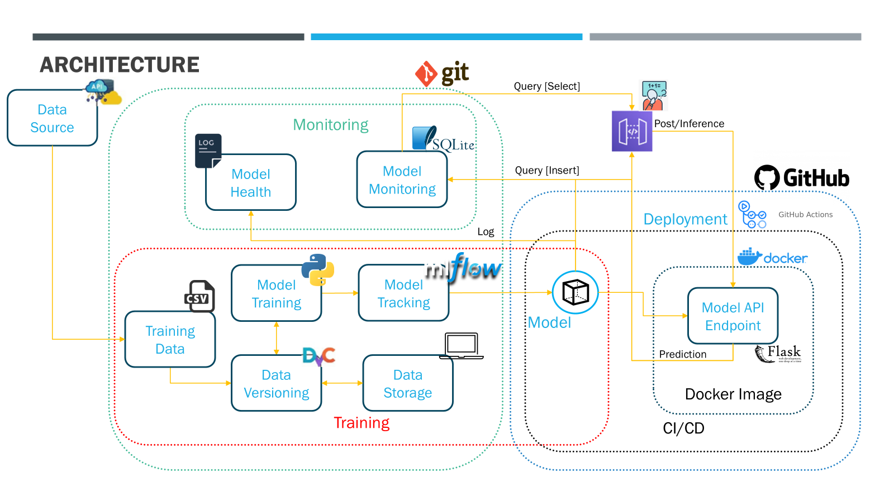

# 🏠 MLOps Pipeline: California Housing Price Prediction

This project demonstrates a complete **MLOps workflow** for deploying and monitoring a machine learning model that predicts housing prices using the California Housing dataset.

---

## 🚀 Project Structure

```
mlops-housing-pipeline/
├── api/
│   └── main.py               # Flask API serving the model
├── src/
│   └── data.py               # Data loading, preprocessing, and new data merge
├── train.py                  # MLflow-based training and model logging
├── retrain_trigger.py        # Auto-retraining on new data detection
├── deploy.sh                 # Deployment script using Docker
├── prometheus.yml            # Prometheus scrape config
├── docker-compose.yml        # Compose stack with API, Prometheus, Grafana
├── Docker                    # Script that defines how to build a self-contained environment, ensuring it runs the same way everywhere.
├── requirements.txt          # Lists all the Python libraries and their specific versions that project needs to function correctly.
├── data/
│   ├── raw/                  # Initial dataset (auto-generated if missing)
│   ├── processed/            # Stores scaler.pkl
│   ├── new_data/             # Drop new CSV files here to trigger retrain
│   └── archive/              # Stores processed new_data files
├── .github/
│   └── workflows/
│       └── ci-cd.yml         # GitHub Actions pipeline
```
Architecture diagram



---

## ⚙️ Features

### ✅ Model Serving with Flask
- Loads model from MLflow Registry (Production stage)
- Applies preprocessing with a stored `scaler.pkl`
- Input validation via `pydantic`
- Optional SQLite logging and Prometheus metrics

### ✅ CI/CD with GitHub Actions
- Linting with `flake8`, testing with `pytest`
- Builds Docker image and pushes to Docker Hub
- Optional deployment via `deploy.sh`

### ✅ Monitoring with Prometheus & Grafana
- `/metrics` endpoint exposes:
  - Total requests
  - Success & error counts
  - Request latency
- Grafana visualizes real-time API performance

### ✅ Automatic Retraining Trigger
- `retrain_trigger.py` monitors `data/new_data/`
- New `.csv` triggers model retraining via `train.py`
- Updated model pushed to MLflow Registry

### ✅ Deployment Helper Script
- `deploy.sh` provides a simple command-line tool to:
  - Pull the latest Docker image from Docker Hub
  - Run the container locally with environment setup
  - Test the API without needing full GitHub workflow or rebuild

---

## 🔄 Usage Guide

### 🚢 Run with Docker Compose
```bash
docker compose up --build
```

- API: [http://localhost:5001](http://localhost:5001)
- Prometheus: [http://localhost:9090](http://localhost:9090)
- Grafana: [http://localhost:3000](http://localhost:3000)
  - Default login: `admin / admin`

### 🔁 Automatic Retraining
In another terminal, start the retraining watcher:
```bash
python retrain_trigger.py
```

Then drop any valid `.csv` into `data/new_data/`.

✅ If valid columns are detected, new data will be:
- Merged with existing data in `data/raw/`
- Used to retrain the model
- New model logged to MLflow Registry

🗂 The processed file is archived under `data/archive/`.

---

## 📦 API Endpoints

| Endpoint        | Method | Description                                    |
|-----------------|--------|------------------------------------------------|
| `/predict`      | POST   | Predict housing price from features            |
| `/health`       | GET    | Check model/scaler health status               |
| `/metrics`      | GET    | Prometheus metrics endpoint                    |
| `/retrain`      | POST   | *(Optional)* Trigger model retraining manually |

---

## 📁 Valid Input Format (New Data)

```csv
MedInc,HouseAge,AveRooms,AveBedrms,Population,AveOccup,Latitude,Longitude,target
8.3252,41,6.9841,1.0238,322,2.5556,37.88,-122.23,4.526
...
```

---

## 📈 Sample Prometheus Metrics

```
# HELP prediction_requests_total Total prediction requests
# HELP prediction_latency_seconds Prediction latency in seconds
# HELP prediction_success_total Successful predictions
# HELP prediction_error_total Failed predictions
```

---

## ✅ Technologies Used

- **MLflow** – Model tracking & registry
- **Flask** – REST API for model inference
- **Prometheus** – Metrics scraping and monitoring
- **Grafana** – Dashboards for visualization
- **Docker + GitHub Actions** – CI/CD pipeline
- **SQLite + Logging** – Lightweight persistent logging
- **Watchdog** – File-system based retrain trigger

---

## 📌 Requirements

- Python 3.10
- Docker & Docker Compose
- MLflow Tracking Server running at `host.docker.internal:5000`

---

## 🧠 Future Work

- Add authentication for sensitive endpoints
- Support versioned model rollbacks
- Integrate Slack/email alerts for failed retraining

---

## 📜 License

MIT License © 2025 [Your Name or Organization]
